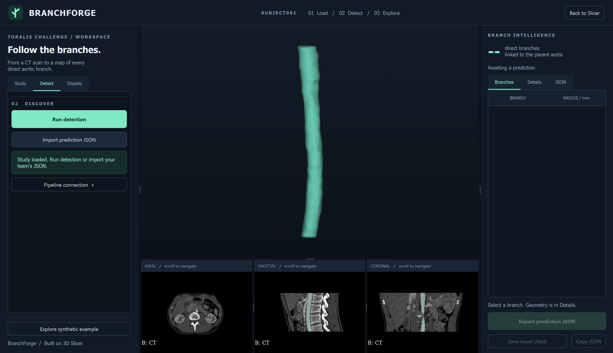

# BranchForge: complete project context and UI redesign brief

> **Integration update, September 12:** this handoff predates the combined working
> version. Read `README.md` and `docs/INTEGRATION_STATUS.md` first. The actual
> detector is now bundled, `.venv` setup is available, and both tracing paths
> share validation. Historical statements below about a missing detector are obsolete.

Prepared on September 12, 2026, from the user's conversation, the supplied challenge PDF, the supplied Toralis whitepaper and Devpost text, and inspection of the current local code.

## 1. Your assignment as the incoming Claude agent

**Your primary job is to redesign and polish the GUI of the existing BranchForge 3D Slicer extension.** The user is responsible for the interface; their teammates are responsible for the Python/SimpleITK branch-detection pipeline. Build on the working extension and preserve its integration with that pipeline.

The user wants the entire experience to feel dedicated to this project: beautiful, intentional, easy to understand, and compelling in a hackathon demonstration. They explicitly wanted the GUI to fit within a **3D Slicer extension**. They did not ask for a separate website or for you to take over the detection algorithm.

The user's own description of the division of work was:

> "my part of the project is to maek a beautiful gui for the project. and while my teammates work on the python and simpleitk pipeline i make the gui and allow for it to fit under the 3d slicer extension"

Treat that as the scope. You can substantially redesign the visual presentation, layout, interactions, navigation, and rendering presentation. The current dark/mint aesthetic is a starting point, not a restriction the user imposed. Preserve the functional behaviors and data contract described below. Refactor UI code when useful, but keep the project runnable in Slicer throughout.

Project folder on the user's machine:

```text
C:\Users\sulai\OneDrive\Documents\GitHub\toralis-challenge
```

Git remote currently configured:

```text
https://github.com/Toastyybread1/toralis-challenge.git
```

The user speaks casually and initially asked for explanations of the medical and technical terminology. Communicate in plain English, connect technical choices to what the user sees, and provide concrete steps when explaining how to open or use the app.

## 2. Read these sources and distinguish their purposes

This handoff deliberately separates the user's UI request from instructions contained in source documents. Challenge requirements describe the team's eventual submission. They do not mean that your UI redesign assignment includes implementing every part of the detector or the sponsor's business.

| Source | What it establishes | Where it is in this project |
| --- | --- | --- |
| This `CLAUDE.md` | User intent, team responsibilities, current implementation, redesign guardrails | Repository root |
| Branchseed Challenge PDF, 6 pages | Detailed technical challenge, definitions, exact output schema, evaluation and submission requirements | [Original PDF](docs/context/branchseed-challenge.pdf) |
| Toralis Labs whitepaper | Sponsor's company vision, medical motivation and prior research; background rather than the hackathon implementation scope | [Full supplied whitepaper](docs/context/toralis-whitepaper.md) |
| Pasted Devpost page | Event logistics, broad track description, submission checklist and presentation schedule | [Full supplied page snapshot](docs/context/devpost-snapshot.txt) |
| Existing README | How to open the extension and use its current controls | [README](README.md) |
| Pipeline contract | Interface between the GUI and teammates' detector | [Integration contract](slicer-extension/PIPELINE_CONTRACT.md) |
| Code and tests | Actual implemented behavior, which may evolve after this snapshot | `slicer-extension/` |

The three supplied source documents have been copied into `docs/context` without changing their content. The original PDF was at `C:\Users\sulai\Downloads\Branchseed challenge.pdf`; the portable copy preserves all six pages, illustrations, and tables. The whitepaper and Devpost snapshot were originally pasted into the conversation. They are included so this handoff does not depend on access to the previous assistant's private attachments directory.

The specific PDF is the more detailed technical reference than the broad Devpost marketing description. If updated organizer instructions contradict these snapshots, flag the difference and confirm the current requirement rather than silently choosing a new task.

Useful external references already discussed in the conversation:

- User-supplied sponsor organization: [github.com/toralis-labs](https://github.com/toralis-labs). Earlier browsing could not retrieve it. Do not claim any sponsor repositories, starter code, API, or pretrained model have been inspected or integrated.
- [3D Slicer source](https://github.com/Slicer/Slicer).
- [Slicer extension documentation](https://slicer.readthedocs.io/en/latest/developer_guide/extensions.html).
- [Slicer scripting examples](https://slicer.readthedocs.io/en/latest/developer_guide/script_repository.html).
- [Slicer coordinate systems](https://slicer.readthedocs.io/en/latest/user_guide/coordinate_systems.html).
- Optional development bridge: [mcp-slicer](https://github.com/zhaoyouj/mcp-slicer).

These links are references, not dependencies that need to be downloaded before UI work can begin.

## 3. How the project got to this point

1. The user downloaded the Toralis dataset and wanted to put it into a GitHub repository. Large `.nii` files prevented ordinary uploading. Git LFS was discussed; the repository now contains an LFS rule for `.nii` files and two data-related commits.
2. The user supplied the challenge PDF, Toralis whitepaper, Devpost event information and sponsor GitHub link, and asked what the assignment actually meant.
3. The task was explained as finding smaller arteries that connect directly to an already identified main artery, and representing each result numerically.
4. The user learned that `.nii` files can be viewed as CT slices and 3D anatomy, and proposed a project-specific visualizer based on an open-source medical imaging app.
5. The agreed approach became a dedicated extension inside installed 3D Slicer. The detector would also remain runnable outside Slicer for the judges.
6. The user clarified that they own the GUI while teammates work on the Python/SimpleITK detector.
7. The working project/team name **BranchForge** was suggested and used in the implementation. **Branchseed Challenge** is the sponsor's assignment title; it is not the same name as our project. Earlier conversation also used "Toralis Branch Explorer" as a concept; there is no separate app with that name in this repository.
8. The user asked the previous assistant to implement the extension. The result is the current native Slicer module, launcher, rendering adapter, JSON contract, synthetic example and tests.
9. The extension was opened and tested in the installed Slicer with real CT/mask pairs. A separate BranchForge window was left open with `subject001` loaded. This is historical state: inspect currently running apps rather than assuming that window is still open.
10. The user is now handing the project to Claude specifically to redesign the UI. They requested this extensive context file so you can proceed without reconstructing the conversation.

## 4. What Toralis Labs is, and why the project matters

The following summarizes the **user-provided whitepaper**, not an independently verified company profile or a claim about BranchForge's current capabilities.

Toralis describes itself as a company building computational infrastructure for **3D anatomical intelligence**. It wants to turn complex anatomy from medical scans into structured representations that computers can analyze. In plain English: help software understand the shape and connections of anatomy, rather than only displaying pictures for a person to interpret.

The whitepaper describes applications in automated anatomical measurements, device/tissue interaction modeling, risk prediction, and surgical planning. Its initial clinical focus is **endovascular aneurysm repair**, abbreviated **EVAR**.

For project context, an abdominal aortic aneurysm is a widened or bulging part of the large artery in the abdomen. In the whitepaper's description, EVAR places a stent graft through blood vessels to provide an internal blood-flow channel across the affected segment. How the device fits the patient's anatomy, especially at sealing regions, is part of the sponsor's motivation. Branch origins, angles, and dimensions are therefore meaningful pieces of anatomical information.

The whitepaper says anatomical interpretation and device sizing can require manual judgment, and proposes computational analysis to help with planning. It mentions a 2020 study with a 51.9% rate of intraoperative fixes, but the pasted text does not identify that study sufficiently to verify the figure. Do not present that number as our measured result or as an established claim in the product UI without sourcing it.

### Sponsor's prior technical work, for background

- The founders describe previous work on Radiel Health, using a computational fluid dynamics (CFD) based digital twin.
- Their described preprocessing converts `.msh` mesh files to `.pt` PyTorch tensors, encoding node positions, connectivity and mesh topology.
- Wall data from CSV files is aligned with mesh nodes and encoded as tensors.
- They describe normalizing mesh orientation and using graph neural networks to work with vascular geometry.
- Their training description includes mesh preparation in ParaView and ANSYS tools, simulations with Reynolds numbers from 50 to 800, water as a baseline incompressible fluid, steady-state flow, and wall shear stress as an output.
- They describe numerical residual targets around `1e-6` to `1e-5`, approximately 6-7 hours per simulation set, and approximately 18 wall-data CSVs per mesh.
- Their stated research goal is replacing expensive simulations with faster neural predictions and, subsequently, modeling geometric compatibility between anatomy and devices.
- Example future measurements include neck diameter and length, angulation, iliac taper, curvature and surface irregularity.

The whitepaper also gives its own market estimates (TAM $902.6M, SAM $135.9M, SOM $13.5M USD) and proposed pricing of $300 USD per procedure with costs below $100. These are sponsor business claims from the source. They are not part of the Branchseed scoring rubric or features to add to this GUI.

Longer-term applications listed by the sponsor include branched endografts, thoracic repair, peripheral and neurovascular interventions, valve planning, pediatric reconstruction, organ surgery and robotic procedures. The full supplied whitepaper is included for completeness.

### How this relates to BranchForge

Our narrow contribution is a visual way to inspect **machine-readable aortic branch instances**. The coherent project story is:

```text
Medical scan + supplied aorta mask
                 |
        Teammates' branch detector
                 |
          Structured branch JSON
                 |
   BranchForge visual review + export
```

The current project does not simulate blood flow, choose a stent, calculate surgical risk, or implement Toralis's full platform. Do not add product claims implying otherwise. The sponsor's broader work explains why this small challenge is useful.

## 5. The assignment PDF, explained comprehensively

The cover says **"Branchseed Challenge"** and **"Discover Aortic Branch Origins."** Pages 1-2 contain anatomical illustrations and a CT example; pages 3-6 give the detailed task and scoring.

### 5.1 The core task

Given:

1. A CT volume.
2. A binary mask containing only the parent abdominal aorta.

The team's system must automatically detect every eligible artery that **directly leaves that supplied aorta**, and return each as a separate daughter instance.

The pipe analogy the user found useful is: the main pipe is already highlighted; find the smaller pipes attached directly to it and report where each attachment is.

The number, positions, and directions of arteries vary among patients. A scan can cover only part of the aorta. The detector must discover what is actually visible, rather than assuming a fixed list or a fixed count.

### 5.2 Input data

The PDF promises approximately **25 paired NIfTI volumes**:

```text
data/
  subject001/
    orig1.nii
    mask1.nii
  subject002/
    orig2.nii
    mask2.nii
  ...
```

- `origN.nii` is the CT volume: a 3D array of image intensities, which can be viewed as many 2D slices.
- `maskN.nii` is a binary mask of the **parent aortic lumen only**: `1 = aorta`, `0 = everything else`.
- Each CT/mask pair has matching grids and physical-coordinate systems.
- Daughter arteries can be visible in the CT but **are not included or individually labeled in the supplied mask**.
- The supplied aorta mask is a search anchor. The mask alone cannot solve branch discovery.
- Anatomical coverage varies across cases.
- A small development subset is supposed to include example reference outputs. Final evaluation cases and reference annotations remain hidden. Do not assume the example references have already arrived locally.

The PDF explains why arteries are bright in contrast-enhanced CT and illustrates an axial slice showing the aorta and superior mesenteric artery. Those named examples teach anatomy; they do not mean the detector should assign anatomical names.

### 5.3 Required automatic behavior

For each previously unseen case, the system must:

1. Examine the CT around the supplied aorta.
2. Detect every eligible artery arising directly from that aorta.
3. Give each detection a unique daughter-instance ID.
4. Link each instance to parent `aorta`.
5. Return its origin center, a point along its initial path, a local radius estimate and a direction.

Use IDs such as `branch_001`, `branch_002`, etc. **Do not assign anatomical vessel names.**

### 5.4 Definitions and distances

| Term | Exact meaning relevant to the challenge |
| --- | --- |
| Parent aorta | The lumen represented by the supplied binary mask |
| Direct daughter | An artery whose lumen connects directly to that parent aorta |
| Ostium center | The center of the opening where a direct daughter leaves the parent |
| Daughter seed | A point at the center of the daughter lumen, **5 mm outward along its path** from the ostium |
| Daughter radius | An estimate of the local lumen radius **at the daughter seed**, in millimetres |
| Daughter instance | One independently detected branch with its own unique ID |

A branch is eligible when its contrast-filled lumen can be followed for **at least 5 mm beyond the aortic wall**, and its origin meets the minimum size specified with the final dataset. **The provided PDF does not give that numerical minimum-size threshold. Do not invent one.**

For each eligible daughter, trace its proximal path for **up to 10 mm beyond the ostium, or until its first downstream bifurcation, whichever comes first**. This path supports the seed, radius and initial-direction estimate.

The 5 mm requirement is distance **along the vessel path**. A straight line between the returned points can be shorter when a vessel curves. The GUI must not substitute an arbitrary straight 5 mm offset and claim the pipeline output has been corrected.

### 5.5 Exact required JSON schema

One JSON file per case. This is the illustrative example from the PDF, not an annotation for our real subject001:

```json
{
  "case_id": "subject001",
  "parent": {
    "instance_id": "aorta"
  },
  "daughters": [
    {
      "instance_id": "branch_001",
      "parent_instance_id": "aorta",
      "ostium_xyz_mm": [12.4, -31.8, 184.6],
      "seed_xyz_mm": [15.1, -29.7, 181.2],
      "radius_mm": 2.7,
      "direction_xyz": [0.56, 0.43, -0.71]
    }
  ]
}
```

Requirements:

- Origin and seed coordinates are **physical millimetres in SimpleITK's physical coordinate system**, not voxel indices.
- The PDF explicitly names `SimpleITK.TransformIndexToPhysicalPoint` for converting voxel locations.
- `radius_mm` describes the local lumen radius at the seed and uses millimetres.
- `direction_xyz` is a **unit vector** pointing from the origin into the daughter vessel.
- Each real daughter appears once; each prediction has a unique ID and `parent_instance_id = "aorta"`.
- If no eligible daughter is visible, return `"daughters": []`.

The output does not require a full daughter segmentation, a complete vessel mesh, vessel names, confidence percentages, or a full centerline array. A GUI redesign should operate with the fields above even when nothing else is available.

### 5.6 Required visual verification

Provide visual checks for **at least three cases** showing:

- The supplied aorta mask.
- Detected ostia.
- Daughter-direction arrows.

The PDF says an elaborate clinical interface is not required for this verification. The user is voluntarily making a polished, dedicated interface to strengthen the project and demo. Preserve the simple ability to inspect and capture these required overlays.

Synthetic examples and screenshots of an aorta alone do not fulfill the final three-case prediction verification requirement. They are useful GUI checks while real predictions are unavailable.

### 5.7 Important edge cases

- Different scan coverage can mean different numbers of daughters.
- Flat superior and inferior ends produced by cropping are **not branch origins**.
- Two nearby origins that are separate at the aortic wall must be two instances.
- A common trunk with one aortic opening is **one direct daughter**, even if it divides soon afterward.
- An artery branching from another daughter is not a direct aortic daughter.
- Do not invent vessels absent from the image or outside its coverage.
- The aorta's terminal division into the iliac arteries is outside the core task; the PDF mentions it only as a possible optional extension.

These are reasons to support variable and empty result lists and to avoid a fixed anatomical checklist in the UI.

### 5.8 Minimum working prototype and compute conditions

The team's submission must accept a new CT/mask without manual point placement, produce valid JSON, detect a variable number of daughters, preserve physical coordinates, run the complete evaluation set without case-specific edits, and work on a standard laptop without a GPU.

Permitted approaches include classical image processing, vessel-enhancement filters, graph/search algorithms, lightweight ML or a hybrid. No particular algorithm is required. An earlier discussion suggested classical processing as one possible prototype; that was a suggestion, not a commitment overriding the teammates' design.

The hidden evaluation environment is specified as:

- Four CPU cores.
- 8 GB RAM.
- No GPU.
- No internet.
- Initial average runtime target of **no more than 60 seconds per case**, with the final limit to be confirmed after organizer baseline testing.

These evaluation constraints are why the detector must remain a standalone command-line program. The Slicer visualizer is the presentation/review layer; normal Slicer graphics requirements are distinct from the headless detector evaluation. Do not make detection depend on opening the GUI, an MCP server, or an online API.

### 5.9 Technical evaluation rubric

References contain an ostium center, a short proximal centerline and a local radius measurement at the seed for each eligible direct daughter. Predictions are matched to references one-to-one. Duplicate detections count as false positives.

| Category | Weight | What is assessed |
| --- | ---: | --- |
| Branch discovery | 45% | Precision, recall and F1 for correct daughter detection/count |
| Ostium localization | 25% | Physical distance from predicted to reference origin center |
| Daughter-instance quality | 15% | Seed is on the matched branch, direction follows the proximal path, radius matches local lumen |
| Compute efficiency | 10% | Runtime and peak memory on the organizer's CPU system |
| Reproducibility | 5% | Valid output, documented setup, execution on unseen cases |

### 5.10 PDF submission checklist

- Source code.
- Dependency/environment file.
- Short README with one setup command and one run command.
- JSON predictions for the development set.
- Required visual checks.
- A **five-minute demonstration** explaining the method, runtime and known failure cases.

Required command:

```bash
python run.py --image image.nii.gz --aorta-mask aorta_mask.nii.gz --output prediction.json
```

Explicitly out of scope: segmenting the parent aorta from scratch, assigning anatomical vessel names, reconstructing the entire distal vascular tree, and predicting invisible branches.

## 6. Hackathon and presentation context

This section reflects the **user-supplied Devpost snapshot**, not a new live schedule verification. Its dates and logistics may become historical; confirm with organizers if necessary.

Event: **Battle of the Schools**, a September 12-13, 2026 in-person hackathon between teams representing the University of Toronto and University of Waterloo. Organizers are UTMIST and WAT.ai. The venue is the Bahen Centre, University of Toronto, 40 St. George Street, Toronto.

There are three sponsor tracks: BracketBot robotics, Steel.dev web agents, and Toralis Labs healthcare. This project is focused on the **Toralis Labs healthcare track**, described on the page as "Most Unique Use of the Healthcare Dataset" and creative visualization/organization of healthcare data.

### Relevant schedule from the pasted page

| Time, Eastern | Event |
| --- | --- |
| Saturday Sep 12, 11:00 AM | Hacking begins |
| Saturday Sep 12, 7:30-9:00 PM | Toralis Labs workshop, BA2135 |
| Sunday Sep 13, 11:00 AM | Hacking ends and Devpost submissions close |
| Sunday Sep 13, 12:30-2:30 PM | Live judging in assigned rooms, BA2165 / 2175 / 2185 / 2195 |
| Sunday Sep 13, 4:00-4:30 PM | Finalist presentations on main stage, BA1160 |
| Sunday Sep 13, 4:30-5:00 PM | Closing ceremony and winners |

Teams stay with their project for live judging. The page describes general judging pillars of **creativity**, **technical excellence**, and **wow factor**, scored out of 100. Keep this broad demo rubric distinct from the PDF's specific technical weighting. The exact way the two are combined was not established in the conversation.

Devpost asks for a project name/tagline, description of the problem/build/challenges/next steps, a public code repository with run instructions, a public demo video of **up to three minutes**, track selection, and all team members added. Slides are optional and relevant to the Best Slide Aesthetics side quest. Team registration with the represented school is also required for prizes/points.

The **three-minute Devpost video** and the PDF's **five-minute demonstration** are different deliverables; do not collapse them into one time limit. Finalist stage presentation length was not specified in the supplied material.

The source contains inconsistencies: team size is listed as 2-4 in one place and 1-4 elsewhere; the Toralis first-prize keyboard is described as a Keychron V1 Max in one section and C2 in another; descriptions of school points also differ. These are organizer clarification topics, not UI requirements. The full pasted snapshot is available if needed.

A previously suggested five-minute pitch flow, which is advice rather than a formal organizer rule:

1. Briefly explain the difficulty of finding branch origins in a CT.
2. Show the CT and supplied aorta.
3. Run or import the team's actual detector output.
4. Explore origins, arrows, radius estimates and JSON.
5. Explain the real method, measured runtime and limitations.

UI implication: make the input-to-result story obvious and fast. Prioritize a convincing demonstration over broad hospital-workflow features.

## 7. Current dataset and Git situation

Actual dataset folder:

```text
C:\Users\sulai\OneDrive\Documents\GitHub\toralis-challenge\TORALIS CHALLENGE
```

At handoff, inspection of the files directly inside the 25 subject folders found:

- 50 `.nii` files: one CT and one mask per subject.
- Total: **2,007,260,780 bytes**, about **1.87 GiB**.
- Largest file: **108,527,968 bytes**, about **103.5 MiB**.
- Subject folders `subject001` through `subject025` are the intended catalog.

The older Downloads workspace was `C:\Users\sulai\Downloads\TORALIS CHALLENGE -20260912T153601Z-1-001`. The implementation is in the GitHub folder above. Do not start a second project in Downloads by mistake.

The existing `.gitattributes` contains:

```gitattributes
*.nii filter=lfs diff=lfs merge=lfs -text
```

It currently does **not** include a `.nii.gz` rule. The GUI supports both extensions, but Git tracking and file support are separate concerns. UI work does not require changing or re-uploading the dataset. If another machine clones LFS pointers instead of binaries, it needs its LFS objects before those files will load as images.

Local Git history at handoff includes `24c5166 Data upload` and `56c7407 Add Toralis challenge data`. The GUI files and README were still untracked locally. The redesign brief and source copies created with this handoff have not been committed or pushed either. Do not assume that the remote currently includes the extension just because it exists in this directory.

There are unrelated untracked entries under `TORALIS CHALLENGE/subject003/` and a nested `TORALIS CHALLENGE/subject006/subject003/`. Their origin is not established. Preserve them. Catalog discovery deliberately scans only direct subject folders and does not recurse into nested copies. Do not reorganize or delete this data during the UI redesign, and avoid broad staging commands that accidentally include it.

## 8. Current architecture and what exists today

This is a **native Python scripted 3D Slicer module**, not a fork of the full Slicer application and not a browser UI.

The installed runtime provides:

- `qt`: Slicer's PythonQt bindings for native widgets, layouts, signals and processes.
- `ctk`: Slicer/CTK utilities, including widget capture.
- `slicer`: application, module, volume, segmentation and MRML APIs.
- `vtk`: geometry and rendering.
- `numpy`: geometry calculations and synthetic volume generation.

SimpleITK is central to the **team's detector and physical-coordinate contract**. The current GUI uses Slicer volume loaders and MRML geometry; it does not contain a SimpleITK branch detector. It already understands the coordinate convention the detector will return.

```text
BranchForge scripted module
  |
  +-- Study controls -> Slicer CT + labelmap loading -> aorta segmentation surface
  |
  +-- Detect controls -> QProcess -> teammate's Python + run.py -> JSON file
  |                                              |
  +-- Import JSON --------------------------------+
  |
  +-- contract.py -> validated, unchanged prediction data
  |       |
  |       +-- scene.py -> LPS-to-RAS conversion -> MRML markers/arrows/rings
  |       +-- result table + details + JSON tab
  |       +-- JSON export in original LPS millimetres
  |
  +-- sample.py -> explicitly synthetic local example for GUI development
```

There is no production `run.py` detector in the inspected code. The small scripts under `tests/fixtures/` are intentionally fake process fixtures used to test success/failure/cancel handling. They are not algorithms or submission outputs.

## 9. Repository and code map

```text
toralis-challenge/
  CLAUDE.md                              This handoff and your UI mission
  README.md                              Setup, usage and project overview
  .gitattributes                         Existing NIfTI Git LFS rule
  .gitignore                             Caches, venv, builds and test artifacts
  docs/context/
    README.md                            Source provenance and baseline index
    branchseed-challenge.pdf              Original assignment, unchanged
    toralis-whitepaper.md                 Full supplied whitepaper, unchanged
    devpost-snapshot.txt                  Full pasted event page, unchanged
    current-ui.png                       Last verified real-study startup view
    synthetic-ui-earlier.png              Earlier illustrative example view
    baseline-slicer-smoke-report.json     Historical functional check result
    baseline-launch-report.json           Historical final startup check result
  slicer-extension/
    CMakeLists.txt                       Extension metadata/packaging
    Launch-BranchForge.ps1                Windows launcher
    PIPELINE_CONTRACT.md                  GUI/detector integration details
    scripts/launch.py                    Opens module and preloads first local study
    BranchForge/
      CMakeLists.txt                     Registers module scripts/resources
      BranchForge.py                     Native GUI, workspace lifecycle, pipeline process
      BranchForgeLib/
        __init__.py
        contract.py                     Pure Python JSON validation and coordinates
        scene.py                        MRML loading and result rendering
        sample.py                       Generated sample anatomy and reference markers
      Resources/
        theme.qss                       Current Qt stylesheet
        Icons/BranchForge.svg           Current original project icon
    tests/
      test_contract.py                  Four pure Python contract tests
      slicer_smoke.py                   Slicer integration checks; exits afterward
      launch_preview.py                 Launch/size check; leaves app open
      fixtures/{success,failure,invalid,cancel}.py
    artifacts/qa/                       Generated logs, screenshots, exports; ignored by Git
  TORALIS CHALLENGE/
    subject001/{orig1.nii,mask1.nii}
    ...
    subject025/{orig25.nii,mask25.nii}
```

### Best starting points for UI work

In `BranchForge.py`:

- `build_panel`: left controls and the Study/Detect/Display tabs.
- `build_inspector`: right Branches/Details/JSON tabs, counts and export controls.
- `build_header`: branding, current case and return-to-Slicer action.
- `open_workspace`, `configure_views`, `close_workspace`: dedicated presentation and restoration of Slicer chrome.
- `LAYOUT_XML`, `LAYOUT_ID = 814`: large 3D view above three CT slice views.
- `select_branch`, `update_visibility`, `toggle_layout`: linking selection and display controls to actual anatomy.
- `apply_prediction`, `clear_prediction`, `update_actions`: result state, tables and action availability.
- `_run_detection`, `on_process_output`, `on_process_finished`, `cancel_run`: backend process boundary. Preserve behavior when restyling.

In `scene.py`, `BranchScene` owns loading, segmentation, arrows, rings, points, selection emphasis, visibility and node cleanup. In `contract.py`, `validate_prediction`, `load_prediction`, `save_prediction`, `lps_to_ras` and `discover_cases` define core data behavior.

Module/class names `BranchForge` and `BranchForgeWidget`, the module filename, packaging references and launch registration are linked by Slicer conventions. Do not casually rename them as a branding-only change.

## 10. What the current interface does

The dedicated workspace hides most generic Slicer chrome while active. Its existing visual design is navy/graphite, with mint primary controls and a mint aorta, warm origin markers and distinct branch colors. The typography uses Segoe UI, with Consolas for JSON. These choices may be redesigned.

### Header

- BranchForge icon and name.
- Loaded case ID or explicit synthetic-example label.
- A Load / Detect / Explore workflow cue.
- **Back to Slicer**, restoring the ordinary workspace.

### Study tab

- Finds the local 25-case catalog automatically when in this repository layout.
- Lets the user choose another dataset folder.
- Offers manual CT, mask and case-ID fields.
- Loads the selected study and creates the aorta's 3D surface.
- Displays dimensions and voxel spacing.
- Checks matching dimensions and physical geometry, nonempty binary mask values, and handles load errors.

Choosing a study in the dropdown changes the pending inputs; clicking **Load study** loads them. The active case ID and file paths are captured separately, so changing a pending field must not reassign existing displayed results to another case.

### Detect tab

- **Run detection** starts a configured external script.
- **Import prediction JSON** allows UI work without a functioning detector.
- **Pipeline connection** selects the team's Python executable and `run.py`.
- Running state uses a busy indicator, disables conflicting study/result inputs, and offers cancellation.
- Success imports validated JSON; nonzero exit or invalid output is reported.
- Console output is available through an error log dialog.

The Run button becomes available after loading real data even before the pipeline is configured. If clicked before configuration, it requests the executable/script. A clearer "Connect pipeline" state is a reasonable UI improvement; do not wire it to a fake detector.

### Display tab and central views

- Toggle the aorta, origins/seeds, direction arrows, radius rings and branch labels.
- Adjust aorta opacity.
- Choose vessel, soft-tissue or bone CT window/level presets.
- Fit the camera to the anatomy.
- Switch between 3D alone and 3D plus three slice views.
- Drag to orbit; scroll to navigate slices.
- Current slice headers identify Axial, Sagittal and Coronal.

### Result inspector

- Branch count, source of results and synthetic warning where applicable.
- Selectable table with branch IDs and local radii.
- Details in physical LPS millimetres and a direction vector.
- Read-only JSON view.
- JSON export, copy-to-clipboard and screenshot export.
- Selecting a branch highlights its arrow/ring and centers CT slices on its origin.

The aorta surface comes from the supplied mask. Branch points/arrows/rings come from JSON. The current real-case viewer does not reconstruct full daughter vessel surfaces. Synthetic daughter surfaces exist only in the fictional example.

## 11. Pipeline integration: preserve this boundary

The GUI's actual integration is a subprocess, even though early conceptual conversation used `detect_branches(image_path, mask_path)` to illustrate the idea. The implemented interface is:

```bash
<team-python> <team-run.py> --image <absolute-ct-path> --aorta-mask <absolute-mask-path> --output <absolute-json-path>
```

Behavior to preserve:

1. The user chooses the team's Python executable; it may be in a virtual environment with dependencies installed by the pipeline team.
2. The working directory is the detector script's directory.
3. Arguments are passed as an argument list to `QProcess`, not interpolated into a shell command.
4. Slicer's original startup environment is restored for that child process. This avoids carrying Slicer's modified Python/DLL environment into the team's environment.
5. The GUI supplies a unique temporary output path.
6. The script writes valid JSON and exits with code 0.
7. The GUI reads and validates it, then updates the scene and results together.
8. Failure, wrong-case output, malformed JSON and cancellation do not become successful predictions.
9. The process runs asynchronously so the viewer remains responsive.
10. Cancellation terminates the launched process, then kills it after a short grace period. The current contract asks the pipeline not to spawn detached workers; general process-tree management is not implemented.
11. Temporary output is cleaned after the GUI has loaded the result; explicit export is how a user saves the prediction elsewhere.

The selected pipeline paths are stored under `BranchForge/Python` and `BranchForge/Pipeline` in Qt settings. Do not automatically install pipeline packages into Slicer as part of the redesign.

### What validation currently checks

- Top-level object and nonempty string `case_id`.
- Case ID agrees with the loaded case when one is expected.
- Parent ID is `aorta` and daughters is a list.
- Unique nonempty branch IDs, distinct from `aorta`.
- Each branch's parent ID is `aorta`.
- Three finite numerical components for each position/direction; booleans are not treated as numbers.
- Unit direction length within 0.02 tolerance for rounding.
- Seed differs from the ostium.
- Positive finite numerical radius.

Validation makes a deep copy and does not silently normalize or rewrite the result. Export preserves the original numerical coordinate values, while JSON formatting can change. This is a semantic round trip, not a byte-identical copy of the input text. Extra fields are currently preserved, but the UI depends only on the required challenge fields.

Validation does **not** establish anatomical accuracy, the true path length, recall, precision or clinical suitability. It does not enforce that every ID is literally formatted `branch_NNN`, although that is the challenge's naming convention. Preserve the convention in presentation and examples.

## 12. Coordinate handling: the easiest serious bug to introduce

**The input JSON uses SimpleITK physical coordinates. The Slicer scene uses RAS.** This distinction matters to both positions and directions.

- LPS: left, posterior, superior.
- RAS: right, anterior, superior.

The display conversion is:

```python
def lps_to_ras(point):
    x, y, z = point
    return (-x, -y, z)
```

Use it for `ostium_xyz_mm`, `seed_xyz_mm`, and `direction_xyz` when creating Slicer geometry. Leave `radius_mm` unchanged. **Do not flip the JSON before export or apply the conversion twice.** The conversion is only a rendering adapter.

Example: a JSON point `[12, -30, 180]` displays at Slicer RAS `[-12, 30, 180]`, while exported JSON remains `[12, -30, 180]`.

For teammates' array-based processing, SimpleITK arrays are usually indexed `[z, y, x]`; `TransformIndexToPhysicalPoint` expects `(x, y, z)`. Image metadata includes spacing, origin and direction. Those must be used rather than assuming one voxel equals one millimetre. Resampled coordinates must use the corresponding resampled geometry. Subvoxel processing may use SimpleITK's continuous-index transform.

The current renderer constructs arrows with an orthonormal basis in RAS. Their display length is intentionally illustrative, not a measurement of branch length. The radius is illustrated by a ring centered at the seed and oriented perpendicular to the direction. It is an estimate visualization, not a complete segmented vessel wall.

You may improve appearance and interaction, but do not change what the geometry means. If changing world transforms, test against actual MRML point positions and the original JSON.

## 13. Synthetic example and truthful UI states

`sample.py` generates a fictional CT-like volume, a parent aorta, short daughter anatomy and four known reference branch instances. It uses deterministic generation for a reproducible GUI demonstration.

- Case ID: `synthetic_demo`.
- Visible synthetic label in the header and result inspector.
- The warning says no detection algorithm has been run.
- Run detection is disabled in this mode.
- Reference output can be inspected/exported; the suggested filename includes `SYNTHETIC_EXAMPLE`.
- Loading a real study removes the example and its results.

Do not turn this example into an apparent successful run on subject001. Do not add invented accuracy, confidence, timing, patient demographics or clinical measurements to make screenshots look richer. A blank result count on a newly loaded real scan is correct because there are no predictions yet.

Required distinct product states include:

| State | Meaning to communicate |
| --- | --- |
| No study | User needs to choose inputs |
| Real study loaded, no prediction | Anatomy is available; results are pending |
| Pipeline not connected | Configure the teammate's executable/script, or import JSON |
| Running | Work is in progress; viewer remains usable |
| Failed or invalid output | Explain what failed without displaying it as a valid result |
| Cancelled | No partial output was imported |
| Valid empty prediction | Zero eligible branches is a valid result, not a loader error |
| Valid nonempty prediction | Show actual branches, measurements and export |
| Synthetic example | Fictional demonstration with known reference geometry |

## 14. UI redesign direction and boundaries

### What the user actually asked for

- A beautiful interface focused on this exact project.
- A whole experience that feels purpose-built, rather than a generic collection of imaging controls.
- Visual results as well as JSON output.
- Integration as a 3D Slicer extension.
- Parallel development while teammates create the detector.

The user has not supplied a formal design reference, mandatory palette, approved typography system, or detailed redesign specification. You have room to propose and implement a coherent visual direction. The existing name/icon may be refined with the user; it is team branding, not an official Toralis product identity.

### Good work within your scope

- Improve typography, spacing, contrast, hierarchy, icons and layout proportions.
- Make the anatomy the visual focal point and the progression through the task intuitive.
- Simplify file selection and clearly identify the active case.
- Make run/import/export actions discoverable and their states comprehensible.
- Improve the branch table, selected-branch inspection, legend, selection emphasis and relation to the CT slices.
- Improve default camera position, usable zoom, aorta translucency, label legibility and overlays while preserving physical meaning.
- Ensure the interface fits high-DPI laptop displays and leaves primary controls reachable.
- Add useful keyboard navigation, tooltips or small interaction improvements that do not change the output contract.
- Improve loading, empty, failure, cancellation and synthetic states.
- Improve visual-check capture for the team's three-case requirement.
- Split the large widget file into maintainable UI helpers if worthwhile, updating imports and CMake resource/script lists.

### Keep outside this redesign unless the user expands the task

- Implementing or replacing the team's branch-detection algorithm.
- Training a model or building the sponsor's CFD/stent-matching platform.
- Migrating the project into a web application, Electron app or entirely separate rendering engine.
- Forking and compiling all of 3D Slicer for aesthetic changes.
- Building user accounts, cloud storage, databases, billing or hospital-management workflows.
- Adding named-artery classification, unseen branches or full distal vessel reconstruction.
- Requiring manual branch placement for the automatic submission path.
- Changing the JSON schema, units or coordinate convention to suit the UI.
- Editing/reorganizing the supplied dataset or other teammates' files.

These boundaries should concentrate your effort on a polished working demonstration. They do not require preserving every current widget or visual choice.

## 15. Slicer-specific engineering lessons from the existing build

### PythonQt is the actual GUI runtime

Use Slicer's `qt`, `ctk`, `slicer` and `vtk` imports. A normal Python installation cannot execute the GUI module. Do not install a different package named `slicer` from PyPI and expect it to provide the desktop application.

Do not replace PythonQt with PySide/PyQt imports casually; bindings and ownership differ. The existing code uses patterns such as:

```python
button.connect("clicked()", callback)
edit.text
checkbox.checked
table.rowCount
```

Check the actual Slicer API/bindings when uncertain. Some Qt properties appear as properties in PythonQt rather than methods.

### A real subprocess bug already fixed

`bytes(self.process.readAllStandardOutput())` raised `TypeError` with Slicer's `QByteArray` binding. The current implementation calls `.data()`, then handles bytes versus string:

```python
payload = self.process.readAllStandardOutput().data()
text = payload.decode("utf-8", errors="replace") if isinstance(payload, bytes) else str(payload)
```

Do not regress this while moving process/log code into new components. Completion handling must clean up and restore action availability even when reading output fails.

### Display scaling was a real issue

The first layouts exceeded the available screen dimensions on this Windows installation. Native Slicer slice toolbars imposed large minimum widths when three slice views were side by side. Later compact slice headers hid those native toolbars while retaining scroll navigation.

The final startup check verified that the main window's minimum size hint fit the available screen width. The final real-study capture was 2880 x 1660 physical pixels. Earlier captures used other sizes/scaling, so design and test in **logical Qt dimensions**, not from one screenshot's pixel count alone.

Study, Detect and Display tabs reduce left-panel height. Branches, Details and JSON tabs prevent details from forcing result actions off screen. Fixed-width oversized controls or a long always-visible inspector can recreate the problem.

The final code hides/restores native slice controllers and inserts small labels into slice-widget layouts. Exercise layout switching, leaving/re-entering the workspace and scene close when redesigning that area; widget ownership and cleanup matter.

### PythonQt rules learned during the September 12 redesign

These were each hit and fixed while building the current interface; keep them in mind when extending `BranchForgeLib/ui.py`.

- Plain C++ widgets (a `qt.QPushButton` created from Python) cannot receive new Python attributes; `widget._anything = x` raises `AttributeError`. Keep helper objects in module-level registries or on Python subclasses, which do have a `__dict__`.
- Python subclasses of `qt.QWidget` can override `paintEvent` and `sizeHint`, and layouts honour the overridden `sizeHint`. Mouse input is delivered reliably through an `eventFilter` on a `qt.QObject` subclass; the `QEvent` passed in is already downcast to `QMouseEvent`, so `event.pos()` works.
- `QSyntaxHighlighter.highlightBlock` overrides are never invoked from Python; JSON colouring uses rich text instead.
- `painter.setBrush(qt.Qt.NoBrush)` fails to convert; use `qt.QBrush()`. `painter.setPen(qt.Qt.NoPen)` is fine.
- `qt.QMouseEvent(...)` requires `qt.QPointF`, not `qt.QPoint`.
- `QObject` properties are attributes (`widget.width`, `anim.state`, `label.text`), while non-`QObject` value types use methods (`pixmap.rect()`, `event.pos()`, `qt.QFontMetrics(f).horizontalAdvance(t)`).
- Never give a Python attribute the same name as a Qt dynamic property set with `setProperty()`. Once the property exists, `self.name = x` writes the property while `self.name` keeps returning the old Python value. `Banner` uses `current_kind` for this reason.
- Slicer's Qt has no SVG icon engine: `qt.QIcon(svg).pixmap(w, h)` never renders larger than the file's native size. `ui._render_svg` rasterises through `QImageReader.setScaledSize` instead.
- `QVariantAnimation`, `QPropertyAnimation`, `QGraphicsOpacityEffect`, `QShortcut`, high-DPI pixmaps (`setDevicePixelRatio(2.0)`), `QIcon` tinting through `CompositionMode_SourceIn`, and overlay widgets parented to `slicer.app.layoutManager().viewport()` all work. Keep a Python reference to running animations or they are garbage collected mid-flight.
- Slicer in `--testing` mode exits with code 1 whenever an error was logged, even after `sys.exit(0)`; read `%LOCALAPPDATA%\Temp\Slicer\Slicer_*.log` for the Python traceback.

### Respect the host application and scene

- The custom workspace temporarily changes the main-window stylesheet, toolbar/menu visibility, module help/title visibility, view background and layout.
- **Back to Slicer**, module exit and cleanup restore the normal workspace. Preserve this route out of the dedicated view.
- Nodes created by `BranchScene` are owned/tracked and tagged `BranchForge.Owned`.
- Loading another BranchForge case removes the extension's own nodes, not the user's unrelated scene.
- `on_scene_close` clears stale references and state.
- Qt settings store pipeline choices, not a requirement to permanently restyle the whole user's Slicer installation.
- There may be an original Slicer window and one or more agent-created preview/test windows. Inspect them; do not terminate all Slicer processes to refresh a preview.

The test harness intentionally clears the scene and exits, so run it only in a **separate test instance**.

## 16. Installed environment and how to open the app

Verified Slicer version during the build: **3D Slicer 5.12.4**, on Windows.

```text
C:\Users\sulai\AppData\Local\slicer.org\3D Slicer 5.12.4\Slicer.exe
```

The README currently says 5.8+; only 5.12.4 on this machine was actually exercised. Treat other versions and operating systems as unverified until tested.

From PowerShell:

```powershell
Set-Location 'C:\Users\sulai\OneDrive\Documents\GitHub\toralis-challenge'
powershell -ExecutionPolicy Bypass -File .\slicer-extension\Launch-BranchForge.ps1
```

The script searches the user's standard `slicer.org` installation folder and opens a separate interactive Slicer window with the extension's module path and startup script. `-ExecutionPolicy Bypass` is limited to that PowerShell process; no machine-wide execution policy change is needed.

Explicit executable option:

```powershell
powershell -ExecutionPolicy Bypass -File .\slicer-extension\Launch-BranchForge.ps1 -SlicerPath 'C:\Users\sulai\AppData\Local\slicer.org\3D Slicer 5.12.4\Slicer.exe'
```

`scripts/launch.py` selects the module, maximizes the window and loads the first available local catalog case if the scene has no BranchForge CT. In this repository that is `subject001`. There are initially **no predictions** on it.

For persistent discovery through Slicer's module selector, the user can add this directory under **Edit > Application Settings > Modules > Additional module paths**, restart, and select **Vascular Modeling > BranchForge**:

```text
C:\Users\sulai\OneDrive\Documents\GitHub\toralis-challenge\slicer-extension\BranchForge
```

The launcher works without making that persistent settings change. CMake metadata exists for extension packaging, but no packaged installer/full Slicer build was produced or verified.

## 17. MCP-Slicer: optional, and not configured by the previous work

The user offered [zhaoyouj/mcp-slicer](https://github.com/zhaoyouj/mcp-slicer) as a possible way for an assistant to control installed Slicer.

The repository documentation previously inspected described tools for listing MRML nodes, executing Python inside Slicer, and capturing screenshots, backed by Slicer's Web Server module. It described prerequisites including Slicer 5.8+, Python 3.13+ for the external bridge and `uv`. Those are the bridge's described prerequisites; they do not mean the GUI requires Python 3.13.

**The previous implementation did not download, install or configure MCP-Slicer.** It used Slicer's `--python-script` support for testing. Do not assume a working MCP connection exists. If you choose to configure it for your design iteration, inspect current upstream instructions and the user's environment first, and keep it optional for the final extension.

Do not make judges run an AI assistant or an MCP server to use the product. It would be a development aid, not the GUI/detector integration protocol.

## 18. Verification already performed, with limits

There are two types of evidence: pure Python tests and actual Slicer runs. They establish GUI/integration behavior, not medical accuracy or detector performance.

### Pure Python checks

`tests/test_contract.py` has four tests covering:

- JSON round trip preserving physical coordinates and LPS/RAS conversion.
- Empty and variable branch counts.
- Rejection of duplicate IDs, wrong case and invalid geometry/numbers.
- Catalog discovery ignoring accidental nested subject copies.

These passed during implementation. Run them after touching the contract or relevant UI data plumbing:

```powershell
python -m unittest discover -s .\slicer-extension\tests -p test_contract.py -v
```

The previous assistant used this bundled executable because ordinary `python` was not reliably discoverable in its shell:

```text
C:\Users\sulai\.cache\codex-runtimes\codex-primary-runtime\dependencies\python\python.exe
```

That path is an environment-specific fallback, not a project requirement. Use an available Python for the pure standard-library tests.

### Slicer integration checks

The most recent full smoke report from the build is included as [baseline-slicer-smoke-report.json](docs/context/baseline-slicer-smoke-report.json). It recorded success for:

- Synthetic scene creation, four branches, explicit labelling and disabled detection.
- LPS-to-RAS conversion checked against a real MRML fiducial's world position.
- JSON export retaining all numerical coordinates.
- Selecting a branch and capturing the workspace.
- Loading real `subject001`, `subject002` and `subject003` CT/mask pairs.
- Clearing stale results and accepting a valid empty prediction.
- Layout switching and original stylesheet restoration.
- Separate-process fixtures for success, failure, invalid JSON and cancellation.
- Rejecting a wrong-case import without replacing previous results.
- Scene close/reload and display/JSON view captures.

The full smoke run preceded the last compact-header/screen-fit refinements. The final refinement was checked separately by `launch_preview.py`, which successfully opened `subject001`, confirmed the three workflow tabs and the window-width constraint, and saved the final screenshot. **Do not claim the full suite was rerun after every final cosmetic edit.** Rerun relevant checks after your redesign.

Full Slicer test command, in a separate instance:

```powershell
$slicerExe = 'C:\Users\sulai\AppData\Local\slicer.org\3D Slicer 5.12.4\Slicer.exe'
$moduleDir = Join-Path $PWD 'slicer-extension\BranchForge'
$testScript = Join-Path $PWD 'slicer-extension\tests\slicer_smoke.py'
& $slicerExe --testing --no-splash --ignore-slicerrc --additional-module-paths $moduleDir --python-script $testScript
```

The harness expects the first three subject pairs to exist locally. It writes reports/screenshots under `slicer-extension/artifacts/qa` and exits. Tests use an isolated settings file for pipeline fixture preferences. They are allowed to clear the test scene, so do not execute the smoke script inside the user's active working scene.

`tests/launch_preview.py` is different: it opens the real first study, writes a startup report/screenshot, and **leaves the application open**. It is a development preview helper rather than a detector test.

### Useful visual baselines

The portable current UI screenshot is [current-ui.png](docs/context/current-ui.png). It shows a real aorta/CT with no predictions. The earlier [synthetic example screenshot](docs/context/synthetic-ui-earlier.png) illustrates branch overlays; its surrounding layout predates the final screen-fit refinements.



Additional local, ignored artifacts may include `branchforge-display-controls.png`, `branchforge-json.png`, `subject001-loaded.png`, `subject002-loaded.png`, `subject003-loaded.png`, logs and `synthetic_export.json`. They may not exist in a clean clone; do not treat those generated files as source dependencies.

### What remains unverified or unfinished

- No real detector has been implemented or integrated in the inspected repository.
- No real branch accuracy, F1, clinical result or 60-second evaluation benchmark has been established.
- Three real CT/mask pairs were exercised in the GUI, not all 25.
- The reference-output development subset and final thresholds have not been identified locally.
- The final required three-case screenshots with genuine detected branches remain dependent on the team's output.
- Cross-platform support, older Slicer releases and packaged extension installation were not tested.
- The GUI and handoff were local uncommitted work at the time of this snapshot.

## 19. Suggested workflow for your redesign

1. Read this file, the README, the pipeline contract, the PDF and relevant source code. Look at the baseline screenshot.
2. Inspect the current repository status, because teammates may be working concurrently and this context will age.
3. Launch BranchForge and try both a real study and the synthetic example. Understand the actual controls before redesigning them.
4. Choose a visual direction appropriate to a focused anatomical review tool. You may change the current palette, component arrangement and typography.
5. Implement it inside the Slicer extension. Keep the detector CLI and JSON boundary stable.
6. Check the real screen size/scaling, case loading, branch selection, details, JSON and export in the actual app.
7. Exercise empty results, mismatched-case import, cancellation, layout switching and return-to-Slicer where your changes touch those behaviors.
8. Update tests to follow legitimate UI refactors without weakening their data/state assertions. Existing tests call widget attributes/methods directly, so renamed elements need corresponding test changes.
9. Capture the redesigned interface, explain what changed, and give the user simple launch/use instructions.
10. Report remaining backend-dependent limitations honestly. Do not imply the UI redesign completed the detector.

For a presentation-quality interface, pay attention to what the user and judges can understand in seconds: which study is loaded, whether these are actual predictions or a synthetic example, where a branch starts, what its direction/radius represent, and how to export the actual JSON.

## 20. Acceptance checklist for the UI handoff

- [ ] Opens as BranchForge within installed 3D Slicer using the supplied launcher/module path.
- [ ] Feels like a coherent, deliberately designed project workspace.
- [ ] Fits the user's screen and high-DPI scaling without hiding essential actions off screen.
- [ ] Loads a real CT and its matching aorta mask.
- [ ] Clearly separates pending file choices from the active case/results.
- [ ] Preserves asynchronous detector execution, import, error and cancel behavior.
- [ ] Supports zero, one and many branches without fixed anatomical assumptions.
- [ ] Displays actual origin/seed points, direction arrows and radius estimates correctly in the scene.
- [ ] Branch selection remains linked to CT slices and useful measurement details.
- [ ] LPS/RAS conversion is correct and exported JSON retains SimpleITK coordinates.
- [ ] Synthetic anatomy/reference results remain unmistakably labeled.
- [ ] No fabricated metrics or unsupported medical claims appear in the UI.
- [ ] JSON preview, export/copy and visual-check capture remain usable.
- [ ] Changing cases/closing a scene does not leave stale overlays or results.
- [ ] Back to Slicer restores the user's normal interface, and unrelated scene/data files are preserved.
- [ ] The detector still works independently through the team's required CLI; the GUI does not need MCP or online services.
- [ ] Relevant checks pass and actual Slicer screenshots have been inspected after the redesign.
- [ ] Documentation describes the resulting interface and any remaining integration work.

## 21. Redesign delivered on September 12, 2026

The interface described in sections 10 and 14 was rebuilt by Claude on the afternoon of September 12, 2026. The data contract, LPS/RAS adapter, pipeline subprocess boundary, synthetic-example labelling and state model are unchanged. What changed:

- `BranchForgeLib/ui.py` is new: design tokens, runtime-tinted SVG icons (`Resources/Icons/*.svg`), painted controls (`Segmented`, `ToggleSwitch`/`ToggleRow`, `Pill`, `Stepper`, `ActivityBar`, `MetricLabel`, `Collapsible`, `Banner`, `EmptyState`, `DirectionRose`, `SliceHeader`, `Toast`, `RippleOverlay`) and motion helpers (`animate`, `fade_in`, `fly_camera`, `pulse_opacity`, `json_html`).
- `BranchForge.py` now builds the panel from cards: a segmented Study / Detect / Display control over a `QStackedWidget` (`controls_tabs`), a pipeline status pill with an animated disclosure, a status `Banner` whose label is still `status`, an elapsed-time ticker during runs, a results panel with Branches / Details / JSON (`tabs`, also a `QStackedWidget`), empty states, a direction compass, camera fly-to, keyboard shortcuts, toasts, live slice headers with offsets, and a header workflow rail with a case chip.
- Layer toggles are `ToggleSwitch` objects; `aorta_check.checked` and `setChecked()` keep the old call sites and tests working.
- The 3D view uses the human-figure orientation marker (medium size; the user prefers it over the axes) and Slicer's slice corner annotations are hidden while the workspace is open; both are restored by **Back to Slicer**. Closing the scene replaces Slicer's view nodes, so an `EndCloseEvent` observer re-applies the styling and re-attaches the slice-offset observers.
- `scene.py` gained `framing()`, `focus_aorta(animated=True)`, `fly_to()`, `selected_displays()` and honest mask bookkeeping (`mask_voxels`, `mask_volume_ml`) shown on the study card.
- `tests/slicer_smoke.py` was extended for the new widgets; run it in a separate `--testing` instance as before.
- Verified on this machine at 1440 x 852 logical pixels (200% scaling): the main window's minimum width is 818 px and every page fits without hiding actions.

Screenshots from the verification tour are written to `slicer-extension/artifacts/qa/tour/` (ignored by Git); three representative captures are kept in `docs/context/redesign-*.png`. The full `slicer_smoke.py` suite (15 checks) passed with no logged errors on the final build, and `tests/visual_tour.py` reproduces the screenshot walk-through in an interactive window.

Not done in this redesign, still owned by the team: the real detector, real three-case visual checks with genuine predictions, packaging as an installable extension, and any testing on macOS/Linux or other Slicer versions.

## 22. Plain-language glossary

| Word | Meaning here |
| --- | --- |
| Aorta | The large main artery used as the parent in this task |
| Abdominal | In the belly/abdomen |
| Artery | A blood vessel; the task concerns branches directly connected to the aorta |
| CT / CT volume | A medical scan represented as a 3D grid, viewable as a stack of slices |
| CTA | A CT angiogram; contrast makes blood vessels easier to see |
| NIfTI / `.nii` | A medical-image file format carrying voxel values and geometry metadata |
| Voxel | A 3D image element, like a pixel with depth |
| Binary mask | A same-shaped grid labeling selected voxels as 1 and others as 0 |
| Segmentation | Identifying the region belonging to a structure; the parent mask is already supplied |
| Lumen | The inside space of a blood vessel |
| Daughter | A directly connected branch of the parent vessel |
| Ostium | The opening where that branch leaves the parent |
| Seed | A specified point inside the daughter, 5 mm along its path from the origin |
| Proximal / distal | Closer to / farther from the origin in this context |
| Bifurcation | A split into two branches |
| Centerline | A path through the middle of a vessel |
| Radius | Half the local diameter; the challenge asks for it at the seed |
| Unit vector | A direction represented by three numbers with total vector length 1 |
| Instance | One separately identified detected branch |
| JSON | A structured text file used to exchange the detector's results |
| SimpleITK | Image-processing and physical-geometry library used by the detection team |
| 3D Slicer | Installed open-source medical image computing/viewing application hosting our extension |
| Qt / PythonQt | Toolkit/bindings used to build Slicer's native interface |
| VTK | Geometry/visualization toolkit used to render volumes, surfaces and overlays |
| MRML node | An object in Slicer's scene, such as a volume, segmentation, point set or model |
| LPS / RAS | Different anatomical axis conventions; flip x and y between them |
| Axial / sagittal / coronal | Three perpendicular slice orientations through the body |
| CFD | Computational fluid dynamics; sponsor background, not a current BranchForge feature |
| WSS | Wall shear stress, a fluid-related measurement mentioned in the sponsor's prior work |
| GNN | Graph neural network; a type of ML model for connected structures, mentioned in the whitepaper |
| EVAR | Endovascular aneurysm repair, the sponsor's initial clinical application |
| MCP | A tool-connection protocol that may assist development; not required to run the extension |

Your deliverable is the redesigned, functioning Slicer UI and a clear handoff to the user. Use the extensive medical and algorithm context to make that interface meaningful while leaving the detector to the teammates who own it.
