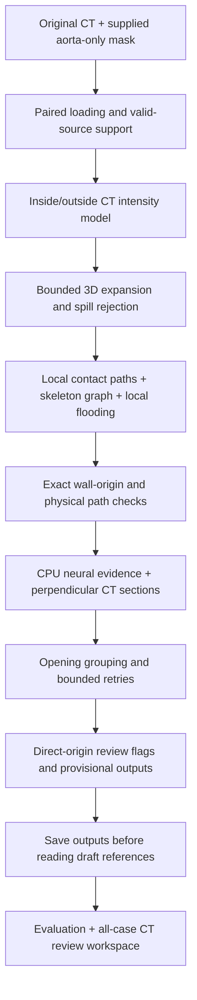

# Current processing path and optimization record

**Master note:** the stage metrics below predate the final challenge-format
eligibility filter. The shipped export has 17/19 draft origin matches, one false
positive and 91.9% F1 on five development cases; see the [current README](../README.md).
Do not substitute intermediate review-group metrics for final exported results.

Latest stage: [second-paper aortic-backbone review](../results/aortic_tree_verified/REPORT.md).
It preserves all 18/19 draft matches and defers one case 21 return connection,
leaving two unmatched counted groups (90.0% precision, 94.7% recall, 92.3% F1).
Raw proposals remain unchanged. Earlier stage results below are historical.
The graph review follows origin triage and precedes output saving; uncertain
graphs remain provisional, and deferred candidates remain available for review.

The product currently provides **provisional direct-daughter origins and proximal
paths for review**. It does not produce an expert-approved vessel segmentation.
The authoritative count is not known in unlabelled cases. There is no target number
of branches, and no retry that reads an expected branch count from a reference.

## Processing path

1. **Load the original pair.** `utils.read_nifti_pair` handles ordinary NIfTI and
   misnamed gzip files. Only a nonorthonormal direction failure invokes the original
   paired resampling fallback: linear CT, nearest-neighbour mask. Case 24 needs
   this mechanism. `image_support.py` distinguishes actual source coverage from
   resampling padding; padding cannot become vessel evidence. All computations
   use physical millimetres and preserve a record of any geometry correction.
2. **Keep the supplied parent fixed.** `border.py` represents its exposed voxel-cell
   faces. A centre-based distance field is not the same as an exact face distance.
   The final origin check uses the exposed faces; parent segmentation is not grown
   or edited in the exported parent mask. Interpolated display resolution does not
   add anatomical resolution.
3. **Estimate blood-like intensity.** `expansion.py` fits smoothed inside/outside
   intensity histograms and forms an inside-versus-outside likelihood ratio. The
   current growth gate is 0.5 with an inside-density support floor. It is not a
   calibrated probability. Exterior samples are taken 5–10 mm from the parent.
4. **Expand in 3D and control spill.** `staged_growth.py` runs the first expansion
   out to 20 mm, blocks excessive additions and repeats out to 25 mm. The current
   rejection combines bulky-region and expansion-volume checks. Subtracting the
   unchanged parent gives the candidate daughter growth. High draft voxel coverage
   alone does not measure spill precision; case 18 remains an important example.
5. **Generate several supported routes.** Contact sampling tests local directions
   rather than relying on one centroid. `daughter_graph.py` uses a skeleton graph;
   `local_flood.py` searches a bounded connected neighbourhood with a clearance-based
   path cost. Numerical duplicates are removed before expensive neural scoring.
   Graph cycles, spur topology and merged growth can still be ambiguous.
6. **Enforce physical geometry.** `daughter_geometry.py` and `audit_prediction`
   check the supplied wall origin, every crossed path voxel, a seed at exactly
   5 mm physical arclength, and recorded proximal extent up to 10 mm. A path that
   reaches only 5 mm remains seed-only. Early splits are unresolved; choosing a
   convenient downstream daughter is not a valid substitute. Diameter is an
   equivalent-circle proxy measured 0.5 mm distal to the wall, with uncertainty
   near the 2 mm eligibility threshold at native sampling.
7. **Measure CT sections and score on CPU.** `opening_verification.py` samples
   perpendicular sections at 1–5 mm along each path, checking central support,
   clipping, shape, intensity contrast and distance from the parent. Existing small
   3D networks score candidate-local crops with four CPU threads. Two model runs
   per held-out fold are combined. Evaluated cases use models trained without that
   case; model/threshold development still repeatedly used the five draft cases.
8. **Group openings and retry only flagged failures.** Opening footprint and path
   agreement both matter; convergent seeds alone do not establish one ostium.
   `adaptive_rescue.py` requires strong CT evidence and different-start agreement.
   `origin_review.py` tests denser alternatives for an existing weak-neural opening.
   `section_review.py` can separate one anomalously merged measurement plane while
   leaving the 3D growth untouched. Every retry preserves rejected evidence.
9. **Expose direct-origin uncertainty.** `origin_triage.py` flags near-end origins,
   uncertain diameter, and a traced distal interval that stays close to the parent.
   It never extrapolates a 5 mm path to 10 mm. These patterns can occur in real
   vessels, so they prioritise review rather than silently deleting detections.
10. **Freeze and compare.** `run_review_pipeline.py` saves predictions first, then
    reads reference landmarks for cases 19–23. Matching is one-to-one at an explicit
    3 mm development origin tolerance. Seed and direction errors are supplementary;
    origin matching alone does not validate them or segmentation width. Geometry,
    mask round trips, CPU time and memory are recorded for all 25 cases.

## How this relates to the two papers

Tahoces supplies the inspiration for intensity-compatible expansion, rejection
of excessive expansion, repeat growth, and parent-contact candidates. The local
histogram estimator and spill thresholds are explicit adaptations. Its anatomical
naming and direction-based exclusions are not copied as universal daughter rules.

Riffaud's method works with an existing vascular tree. Its graph/path concepts
inform proximal traversal, direction and split handling here. It does not solve
our upstream leakage or manufacture a clean tree from a leaky mask. The skeleton
extractor and learned local evidence are additional implementation choices.

The attached Branchseed document is a review and annotation protocol. It requires
visible direct continuity, separate-ostium/common-trunk adjudication, physical
measurements, coverage checks and versioned decisions. Automatic checks support
that process; they do not replace ITK-SNAP inspection or expert sign-off.

Read the historical full-paper notes in `TAHOCES_METHOD_REVIEW.md` and
`RIFFAUD_METHOD_REVIEW.md` for the original reading. Their implementation-status
sections are historical; this guide describes the current code.

## Optimization and measured development progression

These stages used the same five draft-labelled cases, so the progression is not
an independent benchmark. Counts refer to grouped 3 mm origin matching.

| Stage | Matches / 19 | Unmatched groups | Why it helped / limitation |
|---|---:|---:|---|
| Early document pipeline | 11 | 6 | Combined geometry and small-network evidence |
| Supported-path checks | 13 | 4 | Prevented centroid corrections across unsupported cells |
| Conservative contact-face consensus | 14 | 4 | Better wall anchoring without unrestricted face proliferation |
| Bounded local flooding | 15 | 4 | Found curved proximal routes missed by directional tracing |
| Corroborated adaptive rescue | 16 | 4 | Recovered case 19 with CT and agreeing starts |
| Targeted origin refinement | 17 | 3 | Corrected case 21 branch_001 placement |
| Single-plane measurement review | 18 | 3 | Recovered case 23 branch_003; 3D spill remains unchanged |
| Current origin triage and repository cleanup | 18 | 3 | Makes uncertainty explicit; does not claim an accuracy gain |

CPU work is bounded by an analysis ROI, finite contact starts/targets, a local
flood volume budget, numerical deduplication, candidate-local neural crops and
four threads. Physical support checks prevent shortcuts across missing lumen.
The new review index is generated separately, so plotting time is not hidden
inside or counted as detector inference time.

Broader direction searches, globally choosing the highest neural score and
opening every cross-section regressed results or erased small lumen components.
They were not promoted. Numerical thresholds in the retry stages are development
heuristics, not values dictated by the papers.

## What still blocks a final cleanup and release

- **Case 20 branch_004:** a promising experimental path intersects two spilled
  sections. The current single-plane repair cannot justify accepting it. Work on
  local 3D separation, then retest all five labelled cases and all 25 runtime cases.
- **Case 21:** three additional provisional groups need anatomical adjudication.
  The organizer notes are explicitly non-exhaustive. See CASE21.md; do not impose
  the draft's count of three as a detector rule.
- **Coverage and parentage:** a common trunk has one direct aortic origin; nearby
  separate wall openings remain separate. Indirect daughters, crop caps and the
  terminal iliac division must not be silently accepted as core-task daughters.
  Current geometry flags do not conclusively settle these anatomical distinctions.
- **Generalization:** the other 20 cases have no daughter reference masks. More
  labelled, independently reviewed cases are required for a defensible accuracy
  estimate. A successful run is not proof of correct vessel count.
- **Final release:** promote one output contract only after origin, seed, branch
  identity and segmentation checks pass on independent cases. Then remove the
  archived runners and older submission path after confirming no consumers need
  them. Preserve original inputs, required model weights and provenance.

## Verification after this cleanup

136 regression tests passed. Importing `run.py` no longer starts argument parsing
or plotting; its existing submission and review routes are preserved. The original
shell CLI lives in `legacy/shell_cli.py`. Twenty-two obsolete runners and thirteen
historical root-level result directories were archived with 559 verified hashes.
No source CT, aorta mask, model weight or review decision was deleted.

The fresh 25-case outputs, per-case times, review priorities and comparisons with
the preceding frozen predictions are in `rebuild/case21_review_all25/audit.json`.
The original parent and growth masks and predicted paths are checked for equality.

Latest run: all 25 cases completed within 60 seconds; maximum 53.94 s and peak
working set 1137.2 MB. All 25 predicted paths, parent masks and growth masks match
the preceding frozen output; original CT/parent fingerprints are unchanged.
The original cleanup workspace contained 64 montages and 25 records; its per-case
illustration cap was subsequently removed. The corrected workspace illustrates all
133 provisional groups plus one case-24 coverage preview (134 montages); all local asset links
were checked. These are engineering checks, not anatomical sign-off.
